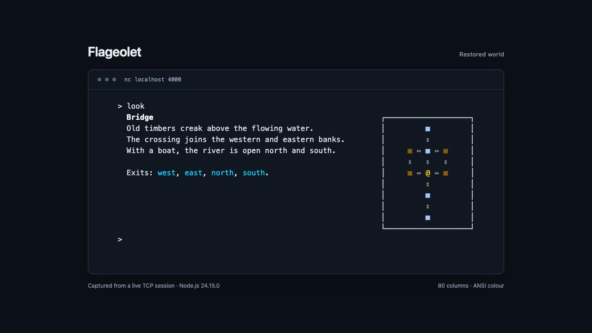
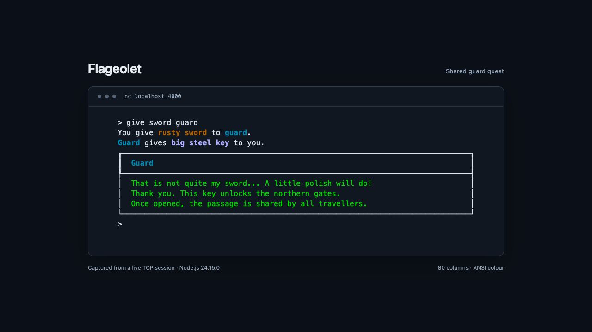

# Flageolet

An early Node.js MUD engine with a TCP terminal interface, ANSI maps, and in-game world editing.

Flageolet is my early **multi-user dungeon (MUD)** project, built in 2016–2018 and recently restored. This experimental personal project combines networking, command interpretation, world modelling, and terminal rendering.



*Recorded from a live `nc` session. `@` marks the player; the map shows nearby rooms.*

## What it implements

- **Shared TCP world:** multiple terminal clients explore and chat, with buffered UTF-8 input and case-insensitive commands.
- **Command interpreter:** aliases, abbreviations, and typed argument patterns for directions, items, and characters.
- **ANSI interface:** colours, box drawing, and a local map built from room connections.
- **English and Russian:** room descriptions, messages, and NPC conversations.
- **Gameplay:** numbered dialogue trees, a shared sword-for-key quest, inventory transfers, locked doors, a wandering bird, and boat-dependent water travel.
- **World editing:** plugins extend commands and messages; the editor creates, connects, edits, and deletes rooms, saving the world as JSON.

The JavaScript/CommonJS code uses Node's TCP and filesystem APIs, with no runtime dependencies.

## Play the demo

```sh
nc flashalet.irln.ru 4000
```

The requested hostname still needs to point to the demo server. Until its DNS is updated, connect with `nc 88.218.62.136 4000`.

Deployments restart the server and disconnect players. Each release resets the world. The public demo includes the world editor, available to every connected player.

## Run locally

Tested with **Node.js 24.15.0** and macOS `nc`. Use a UTF-8 terminal at least **80 columns** wide with ANSI colour support.

```sh
git clone https://github.com/yernende/flageolet.git
cd flageolet
npm start
```

In another terminal:

```sh
nc localhost 4000
```

Sessions start in Russian. Switch with `language en`. The world has **35 connected rooms** across a temple, forest, ravine, bridge, and river. At the altar, try `talk acolyte`, then `2` for directions, `2` to return, and `3` to leave. An empty line repeats a dialogue menu.

To recover the guard's sword and open the northern gates, start at the altar:

```text
language en
north
west
get sword
east
north
talk guard
2
give sword guard
open north
north
```



Connect twice to explore together.

| Command | Action |
| --- | --- |
| `look`, `inventory`, `who` | Inspect the room, carried items, or players |
| `north`, `south`, `east`, `west`, `up`, `down` | Move; abbreviations also work |
| `get sword`, `drop sword`, `give sword guard` | Move items |
| `open north`, `lock north` | Operate a door |
| `say Hello!`, `talk` | Chat or start a conversation |
| `recall`, `commands`, `quit` | Return to the altar, list commands, or disconnect |

Stop with `Ctrl+C`. The default port is `4000`; set `PORT` to override it. Run checks with `npm test`.

GitHub Actions runs tests for pull requests and pushes. Successful `master` releases deploy automatically when deployment is enabled; operational setup is described in [deployment notes](docs/deployment.md).

## Prototype boundaries

Every connected player can use the editor. `save world` writes authored rooms and startup definitions; player progress is temporary. Disconnecting drops inventory in the last room. Restarting resets NPCs, items, the quest, and doors; an item stranded behind a locked gate may require a restart. Accounts, persistent progress, and a trading economy are not implemented. See [recovery notes](docs/recovery.md) for the historical regressions and test coverage.
